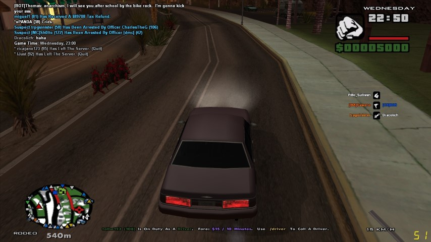

# SAMP-GPS
A modification ASI plugin from [**DK22Pac**](https://github.com/DK22Pac)'s GPS from [**plugin-sdk** source code](https://github.com/DK22Pac/plugin-sdk/tree/master/examples/GPS) for SA:MP game mode.

## Description
GPS will show you a path to destination marker on the radar and in the menu map.

## Screenshots

 

## Download
Download the binary (ASI file) from [**release page**](https://github.com/janglapuk/SAMP-GPS/releases)

## Credits
All credits goes to [**DK22Pac**](https://github.com/DK22Pac)
